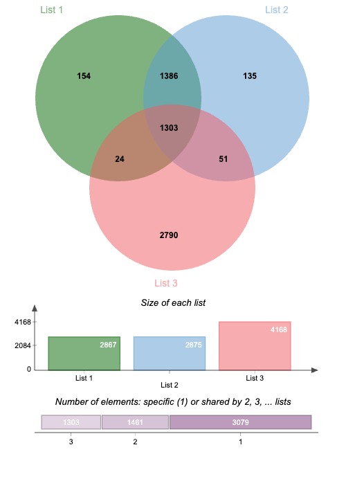

# Gene Finding in Prokaryotic Genomes

## What this project does

Protein-coding genes are contiguous stretches within transcripts that can be translated by the ribosome. They form an open reading frame (ORF) composed of consecutive codons in a single frame, typically beginning with an initiator codon (AUG, UUG, CUG, AUU, or GUG) and terminating at a stop codon (UAA, UAG, or UGA).

Upstream of many bacterial start codons lies a ribosome-binding site, often referred to as the Shine–Dalgarno (SD) motif (canonical sequence: AGGAGGUAA), which base-pairs with the 16S rRNA to position the ribosome for translation initiation. The SD signal can be partial and does not need to be in-frame with the start codon. See the original work by Shine and Dalgarno (1973) for background.

Automated gene calling remains essential for genomes without curated annotations. Numerous tools exist for this purpose; here, we implement a compact, teaching-oriented approach that detects reading frames and searches for an SD-like motif to predict prokaryotic genes.

Our target dataset is the reference genome of Listeria monocytogenes EGD-e (Institut Pasteur), which contains 2,867 annotated genes. Reference: https://www.ncbi.nlm.nih.gov/genome/browse/#!/proteins/159/159660%7CListeria%20monocytogenes%20EGD-e/

## Installation

Create and activate the environment with conda:

```bash
conda env create -f environment.yml
conda activate genepred
```

## How to run

Clone the repository and enter the project directory:

```bash
git clone git@github.com:bilal3005/geneprediction-tp.git
cd geneprediction-tp
```

Run the predictor:

```bash
python3 gpred/gpred.py -i data/listeria.fna \
                       -p results/predicted_gene_positions.csv \
                       -o results/predicted_genes.fasta
```

This command scans the Listeria genome at `data/listeria.fna`, applies a minimum gene length of 50 nt, searches for an SD motif up to 16 nt upstream of putative start codons, and enforces a minimum 40-nt separation between consecutive genes. It writes:
- coordinates to `results/predicted_gene_positions.csv`
- sequences to `results/predicted_genes.fasta`

### CLI options

- `-h, --help`                       Show usage and exit
- `-i GENOME_FILE`                   Input genome in FASTA format (required)
- `-g MIN_GENE_LEN`                  Minimum gene length (default: 50)
- `-s MAX_SHINE_DALGARNO_DISTANCE`  Maximum distance (nt) to search for SD upstream of the start codon (default: 16)
- `-d MIN_GAP`                       Minimum gap between adjacent genes, excluding the SD region (default: 40)
- `-p PREDICTED_GENES_FILE`          Output CSV with predicted gene positions
- `-o FASTA_FILE`                    Output FASTA with predicted gene sequences

## Evaluating predictions

To gauge performance, compare your predictions with reference sets using [jvenn](https://jvenn.toulouse.inra.fr/app/example.html), a web tool for Venn diagram analysis (INRA). Suggested datasets:

1. Predicted genes (this project’s output)
2. Prodigal predictions (`data/prodigal.csv`)
3. Reference gene coordinates (`data/positions.csv`)



This exercise highlights that an SD-centric heuristic alone cannot recover all true genes. Nevertheless, it can reveal a subset of genes missed by more complex pipelines such as Prodigal, illustrating complementary strengths across methods.


## Contact

If you have any questions or need additional information, feel free to reach out via email: bilal.delikaya@etu.u-paris.fr